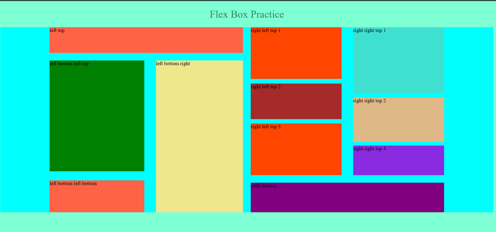

# Flex Box Practice

This repository contains a simple practice project for learning and experimenting with CSS Flexbox.

## Getting Started

To get started with this project, clone the repository to your local machine:

```bash
git clone https://github.com/uzzalcse/flex-box-practice-1.git
```

Navigate to the project directory:

```bash
cd learn_html_css/flex-box-practice-1
```

Open the `index.html` file in your preferred web browser to see the Flexbox examples in action.

## Project Structure

- `index.html`: The main HTML file containing the structure of the Flexbox examples.
- `styles.css`: The CSS file containing the Flexbox styles.

## The Result output will be like the following screen shot




## License

This project is licensed under the MIT License. See the [LICENSE](LICENSE) file for more details.

Happy coding!